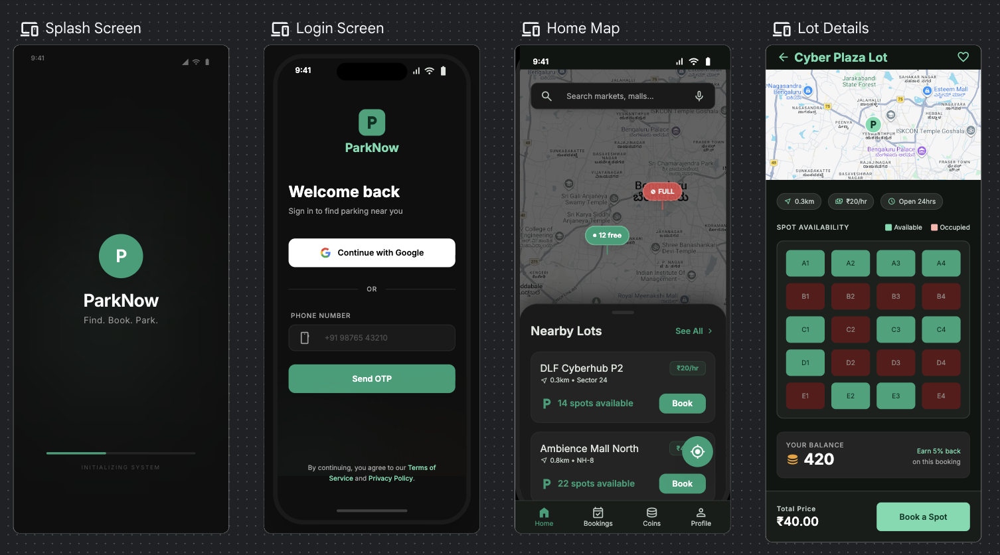
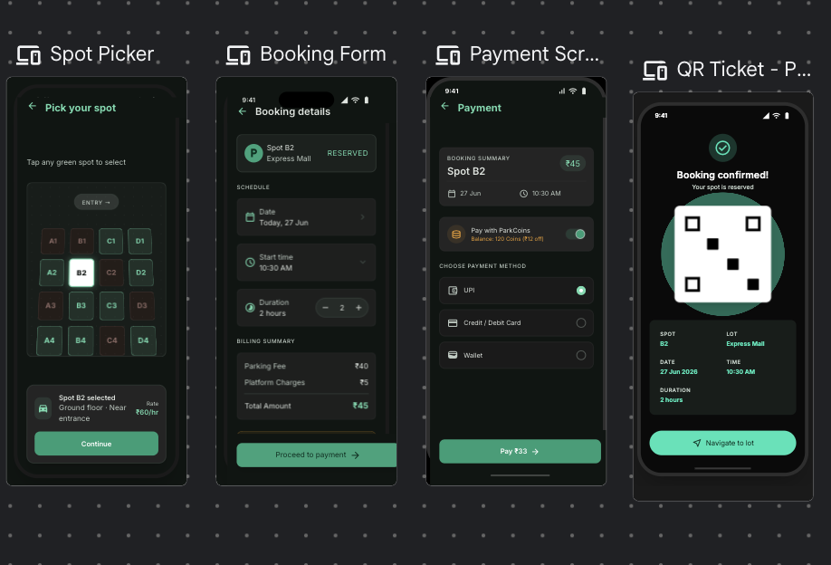
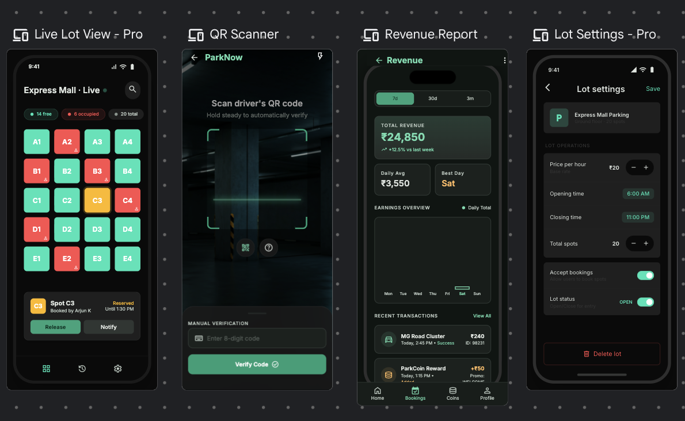
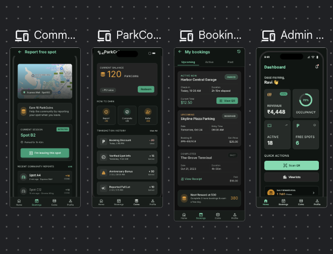

# ParkNow

## Problem Statement
"Shoppers and visitors driving to popular commercial areas and crowded markets waste significant time circling streets looking for available parking spots, creating traffic congestion and pollution, because there is no system allowing them to view real-time parking availability or reserve spaces in advance."

## Problem Validation Scores
- **Severity Score:** 6
- **TAM Score:** 6
- **Whitespace Score:** 6.5
- **Frequency Score:** 8 (happens to people every day)
- **Itch Score:** 81 (out of 100)
- **Category:** Consumer Services

## Why This App
The frequency score of 8 means this is a daily pain point for millions of drivers. The itch score of 81 confirms strong market demand with low existing competition (whitespace 6.5). No current solution combines real-time availability + advance booking + community reporting + rewards in one app for Indian markets.

## The Unique Approach
ParkNow addresses this critical urban issue through a unique, unified approach combining:
- **Real-Time Visibility:** Live tracking of parking lot occupancy.
- **Advance Booking:** Securing parking spots prior to arrival.
- **Community Reporting:** Crowd-sourced updates on space availability.
- **Rewards System:** Gamifying the user experience with ParkCoins to incentivize community contributions and repeat usage.

## Features List
1. Real-time spot availability map
2. Advance booking and reservation
3. In-app payment
4. Community reporting (earn coins for reporting)
5. Navigation to parking spot
6. ParkCoins rewards system
7. QR code entry and exit
8. Admin dashboard for lot owners

## Tech Stack
| Technology / Library | Version | Purpose |
| :--- | :--- | :--- |
| **React Native** | 0.73.0 | Cross-platform framework for iOS and Android |
| **@react-navigation/native** | 6.1.9 | Navigation container and utilities |
| **@react-navigation/stack** | 6.3.20 | Stack navigator for page transition |
| **@react-navigation/bottom-tabs** | 6.5.11 | Tab-based navigation for home interface |
| **react-native-maps** | 1.10.0 | Interactive map interface for locating spots |
| **@react-native-firebase/app** | 18.7.3 | Firebase initialization |
| **@react-native-firebase/auth** | 18.7.3 | User authentication and session management |
| **@react-native-firebase/firestore** | 18.7.3 | Real-time database for parking spot statuses |
| **@react-native-firebase/messaging** | 18.7.3 | Push notifications for bookings and coins |
| **react-native-razorpay** | 2.2.3 | Payment gateway integration |
| **react-native-qrcode-svg** | 6.2.0 | QR code generation for digital tickets |
| **react-native-camera** | 4.2.1 | Camera utility for admin QR code scanning |
| **react-native-reanimated** | 3.6.1 | Fluid UI animations and micro-interactions |
| **victory-native** | 40.1.0 | Analytics and revenue charts for lot owners |
| **zustand** | 4.4.7 | Lightweight global state management |
| **@react-native-async-storage/async-storage** | 1.21.0 | Local device persistence |

## 4-Week Build Plan Summary
* **Week 1: Architecture & Auth:** Scaffold project, define design system theme, configure routing navigators, and integrate Firebase Authentication.
* **Week 2: Map & Real-time Parking:** Build interactive map screens, implement real-time spot tracking via Firestore, and construct the spot picker.
* **Week 3: Bookings & Payments:** Implement booking flows, integrate Razorpay gateway, generate QR code tickets, and develop the ParkCoins reward system.
* **Week 4: Admin Dashboard & Launch:** Design admin metrics screens with Victory Native, add QR camera scanner verification, test workflows, and configure CI.

---
Built by Antigravity — daily commits over 4 weeks

## Setup Instructions
*(Placeholder: Instructions for setting up development environment, installing node packages, and starting the Metro bundler will go here.)*

## Screenshots

### 1. Authentication & Home Map Flow

### 2. Spot Selection & Booking Flow

### 3. Live Admin Lot View & Revenue Reporting

### 4. Community Reporting & Rewards

